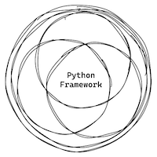

# Python Framework 

<div align="center">



_Sometimes, reinventing the wheel is the best way to learn something._

</div>

This repo implements a python framework from scratch. The idea is to allow developers to understand how request/response workflow interacts with a web application.

### Built With

- Python 🐍

## Getting Started

To get a local copy up and running follow the **Prerequisites** and **Setup** sections.

### Prerequisites

Make sure you have a properly Python & Poetry environment with version ~3.10.

### Setup

1. Clone the repo
   ```sh
   git clone git@github.com:victormartinez/pythonframework.git
   ```

2. Install the dependencies
    ```sh
    cd pythonframework/
    poetry install
    ```

3. Activate virtual environment
    ```sh
    poetry shell
    ```

## Usage

### Run 
```sh
make run  # Available at http://127.0.0.1:8000
```

### Help

```sh
make help
```
